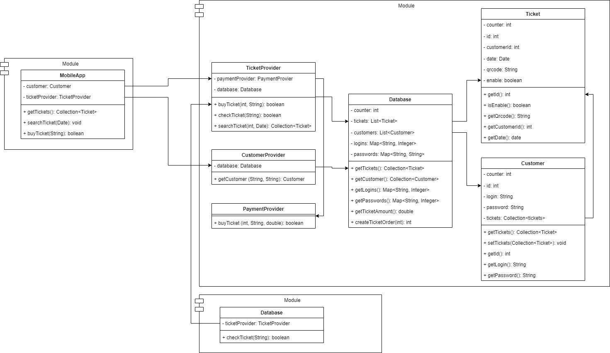

## Урок 4. Компоненты. Принципы связности и сочетаемости компонентов
### Задание
1. Разработать контракты и компоненты системы "Покупка онлайн билетов на автобус в час пик".
2. Разработать Диаграмму компонент комплекса использую нотацию UML (общую схему модулей, без деталей).

### Решение
1. Работа программы "Покупка онлайн билетов на автобус в час пик" представлена в файле Program.java
2. UML диаграмма компонентов системы "Покупка онлайн билетов на автобус в час пик"
